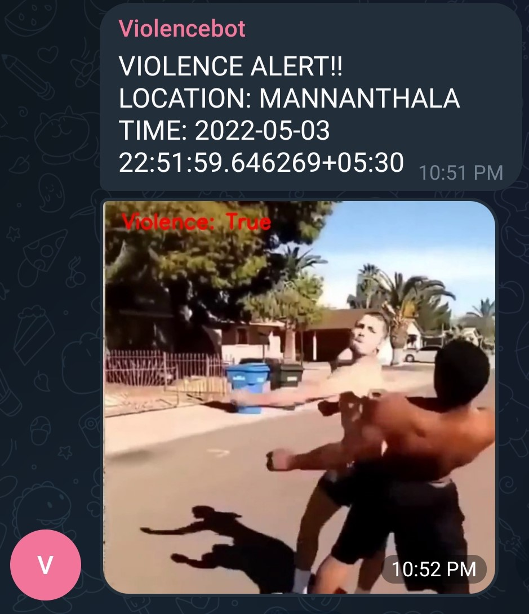

## YOUTUBE VIDEO FOR EXPLANATION
https://www.youtube.com/watch?v=LRqZYtNF0Qs

## Colab Notebook
https://colab.research.google.com/drive/1a5ra5ejumm6qg7TNsPtuHz1-gJqKi2FA?usp=sharing

## Demo Image of the bot in the Telegram group

## How to build a telegram bot and send messages to groups
https://www.youtube.com/watch?v=pZpDCfGCIZI

## StackOverflow for getting group ID
https://stackoverflow.com/questions/32423837/telegram-bot-how-to-get-a-group-chat-id#:~:text=Go%20to%20the%20group%2C%20click,dummy%20message%20to%20the%20bot.&text=4%2D%20Look%20for%20%22chat%22,(with%20the%20negative%20sign).
