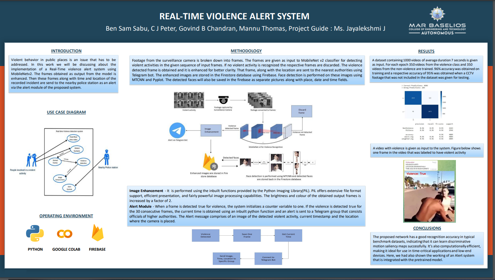

# Violence Alert System (FINAL YEAR PROJECT)
A  violence detector using `MobileNetV2` pretrained model and image enhancement algorithms and face detection algorithms implemented using Python, including an alert system built using telegram for alerting concerned authorities, and all data stored neatly in cloud firestore.

DEMO VIDEO: https://youtu.be/_p3IgezRqwE

## FOR DOING THE PROJECT FOR YOU, WHATSAPP AT +91 9074048360, (THERE WILL BE A PRICE)

## Architecture Diagram

## Explanation

## Stage 1 (Human Detection) ✔✔
A real-time human detector using `Faster RCNN Inception V2 COCO model`, implemented using Python. Main purpose was comparing 3 pretrained models for speed and accuracy.

## Stage 2 (Violence Detection) ✔✔
A real-time violence detector using `MobileNetV2` pretrained model, giving the output in the form of images with the result printed writen on each image using OpenCV, implemented using python. The training file for the mobilenetv2 model has also been included and the testing files and videos as well.

## Stage 3 (Alert System) ✔✔
Creating a telegram bot and a group, adding the bot to the group and whenever violence is detected in any frame, send the 30th `violence=true` frame to the telegram group using the bot, including a message which contains details like Location, Time and Camera ID

## Stage 4 (Image Enhancement) ✔✔
Enhanced the image using the PIL library in-built in python, by increasing it's sharpness and colour by a factor of 1.2, and saved to the local system.
The enhanced image is sent via the telegram bot

## Stage 5 (Face Detection) ✔✔
All the faces obtained in the saved image is plotted and saved on a single image using mtcnn and pyplot and is sent to the telegram group via the bot also.

## Stage 6 (Firebase Integration) ✔✔
All the data, ie, the date, obtained image and the 'detected faces image' are stored in a neat document object format in the cloud firestore service provide by Google's Firebase. The images are stored as links which and these links are obtained by saving it first in the storage bucket of firebase itself. These data can only be obtained by authorized officials.

## Project done ✔✔

## The Team ❤

